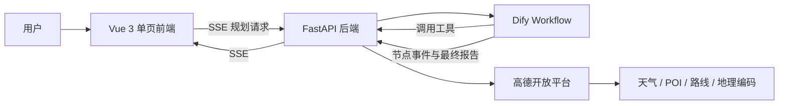

# Travel Assistant

基于 **Vue 3 + FastAPI + Dify + 高德开放平台** 的旅行规划助手。用户填写目的地、出发地、天数、人数、预算和偏好后，前端通过 FastAPI 代理调用 Dify Workflow，并以 SSE 流式接收、展示和导出 Markdown 行程报告。

## 核心能力

- 单页旅行规划：提供完整行程与简要建议两种请求方式，并内置多组快速填充示例。
- Dify 流式工作流：FastAPI 代理 Dify Workflow API，将工作流、节点和文本事件转发给前端。
- 高德工具接口：提供地理编码、路线规划、出租车费用估算、天气、餐厅、POI、景点推荐和预算分配能力。
- Markdown 报告：展示标题、列表、表格、代码和安全图片链接，支持复制及下载 `.md` 文件。
- 主题与连接状态：支持深浅色主题，并在页面中检测后端是否可用。

## 系统架构



Vite 开发服务器会把 `/api` 和 `/dify` 请求代理到 FastAPI，默认后端地址为 `http://localhost:8000`。

## 技术栈

| 层级 | 技术 |
| --- | --- |
| 前端 | Vue 3、Vite 5 |
| 后端 | Python、FastAPI、Uvicorn、Pydantic、Requests |
| 智能工作流 | Dify Workflow、SSE 流式响应 |
| 外部数据 | 高德 Web 服务 API |
| 测试 | Pytest、FastAPI TestClient |

## 项目结构

```text
Travel-Assistant/
├── front/
│   ├── public/                    # 公共静态资源
│   ├── src/
│   │   ├── api/index.js           # 后端健康检查、工作流请求与 SSE 解析
│   │   ├── styles/main.css        # 全局样式与主题变量
│   │   ├── views/TravelPlanner.vue# 旅行表单与报告页
│   │   ├── App.vue
│   │   └── main.js
│   ├── package.json
│   └── vite.config.js
├── backend/
│   ├── api.py                     # FastAPI 应用及高德工具路由
│   ├── dify.py                    # Dify Workflow 代理及 SSE 转发
│   ├── serives/                   # 地图、天气等服务（沿用现有目录名）
│   ├── test.py                    # 后端自动化测试
│   └── API.md                     # 高德工具接口详细说明
├── needed.md                      # 产品方案与工作流设计稿
└── README.md
```

## 快速开始

### 1. 环境要求

- Node.js 18 或更高版本
- npm 9 或更高版本
- Python 3.10 或更高版本
- 高德 Web 服务 Key
- 可访问的 Dify Workflow 应用及其 API Key

### 2. 配置后端

进入后端目录并创建虚拟环境：

```bash
cd backend
python -m venv .venv
source .venv/bin/activate
pip install fastapi "uvicorn[standard]" pydantic requests pytest httpx
```

通过环境变量配置外部服务：

```bash
export AMAP_KEY="你的高德 Web 服务 Key"
export DIFY_API_BASE="https://api.dify.ai/v1"
export DIFY_API_KEY="你的 Dify Workflow API Key"
```

自建 Dify 时，将 `DIFY_API_BASE` 改为实例的 API 根地址，例如 `http://localhost/v1`。不要把真实密钥写入源码或提交到版本控制。

启动后端：

```bash
python api.py
```

后端默认运行于 `http://localhost:8000`：

- 健康检查：`http://localhost:8000/api/health`
- Swagger 文档：`http://localhost:8000/docs`

### 3. 启动前端

在另一个终端执行：

```bash
cd front
npm install
npm run dev
```

浏览器访问 `http://localhost:5173`。如果后端不在默认地址，可在启动前设置代理目标：

```bash
VITE_BACKEND="http://127.0.0.1:8000" npm run dev
```

前端检测不到后端时会禁用规划按钮；当前版本不提供离线 Mock 回退。

## Dify Workflow 输入与输出

前端通过 `POST /dify/workflow/stream` 发送以下 `inputs`：

| 变量 | 示例 | 说明 |
| --- | --- | --- |
| `request` | `帮我安排完整行程` | 用户请求 |
| `destination` | `昆明` | 目的地 |
| `departure` | `成都` | 出发地，未填写时为 `-` |
| `days` | `3` | 旅行天数，数字 |
| `people` | `2` | 出行人数，字符串 |
| `budget` | `3000` | 总预算（元），字符串 |
| `style` | `休闲` | 旅行风格 |
| `special_request` | `第三天下午返程` | 特殊需求 |

Dify 结束节点应将最终 Markdown 放在 `text` 或 `output` 字段中；前端优先读取这两个字段，并在没有最终字段时使用累积的 `text_chunk` 内容。

后端还提供 `POST /dify/travel/plan/stream` 结构化入口。该接口额外要求 `start_date`（`YYYY-MM-DD`），适合其他客户端直接调用；当前网页使用的是兼容任意输入的 `/dify/workflow/stream`。

## 后端接口概览

| 方法 | 路径 | 功能 |
| --- | --- | --- |
| GET | `/api/health` | 健康检查 |
| GET | `/api/geocode` | 地址转经纬度 |
| POST | `/api/geocode/batch` | 批量地理编码 |
| GET | `/api/reverse_geocode` | 经纬度转地址 |
| GET | `/api/route` | 两点路线规划 |
| POST | `/api/route/multi` | 多途经点路线规划 |
| GET | `/api/taxi_cost` | 出租车费用估算 |
| GET | `/api/restaurants` | 周边餐厅推荐 |
| GET | `/api/poi/polygon` | 多边形区域 POI 搜索 |
| GET | `/api/poi/detail` | POI 详情查询 |
| GET | `/api/travel_spots` | 旅游景点推荐 |
| GET | `/api/weather` | 实时天气和未来 3 天预报 |
| GET | `/api/budget` | 旅行预算分配 |
| POST | `/dify/workflow/stream` | 透传 Dify Workflow 并返回 SSE |
| POST | `/dify/travel/plan/stream` | 带日期校验的结构化旅行规划入口 |

完整参数与返回值请参考 Swagger 和 [`backend/API.md`](backend/API.md)。

## 常用命令

```bash
# 前端开发与构建
cd front
npm run dev
npm run build
npm run preview

# 后端测试（测试会 Mock 高德请求，不消耗真实 API 配额）
cd ../backend
pytest test.py -v
```

## 当前实现状态

- 前端已精简为单页旅行规划器，不再依赖 Vue Router、Pinia、本地知识卡片或 Mock 行程数据。
- 已实现后端连接检测、Dify SSE 解析、完整/简要规划、Markdown 图片展示、复制和下载。
- FastAPI 已提供高德工具接口和自动化测试；网页当前直接调用 Dify 工作流，不直接调用各高德接口。
- Dify 工作流、API Key 和高德 Key 必须单独配置，缺少后端或外部服务时无法生成规划结果。
- Markdown 使用轻量级前端转换器，并非完整 CommonMark 实现；复杂嵌套语法的显示效果可能有限。

## 注意事项

- 高德接口需要 **Web 服务类型** Key；浏览器端不持有该 Key。
- 坐标统一使用 `经度,纬度` 格式，例如 `102.712251,25.040609`。
- 当前 CORS 允许所有来源，仅适合本地开发；生产环境应限制可信域名。
- 外部 API 返回的天气、开放时间、价格、评分及路线可能变化，正式出行前应再次核实。
- `backend/serives` 是仓库现有目录名（拼写如此）；重命名时需同步更新 Python 导入路径。
- 若任何真实密钥曾经提交到 Git 历史，请立即在对应平台轮换；从最新源码删除并不能清除历史记录。

## 后续方向

- 增加统一的 Python 依赖文件和环境变量示例。
- 增加 Dify 代理测试、前端单元测试及端到端测试。
- 使用成熟的 Markdown 渲染与 HTML 清理库强化复杂语法及内容安全。
- 补充生产部署配置、鉴权、限流、日志和错误监控。
